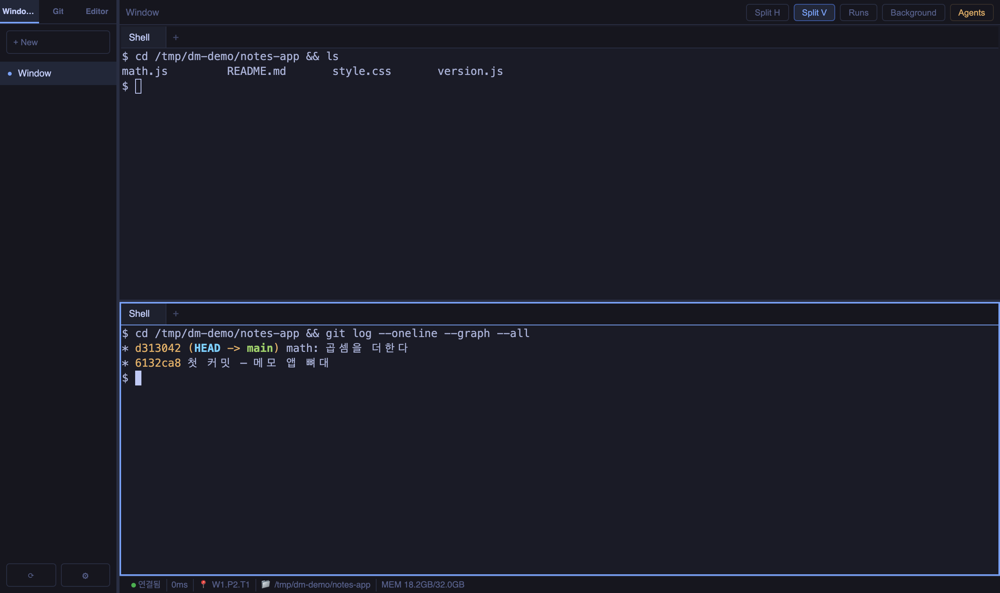
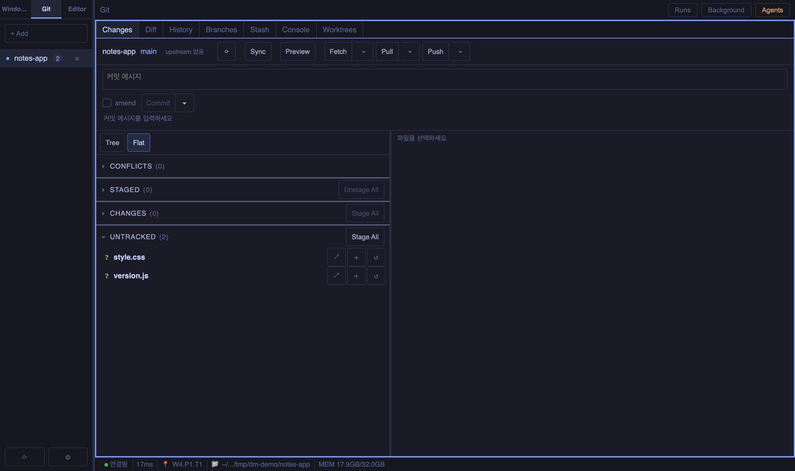
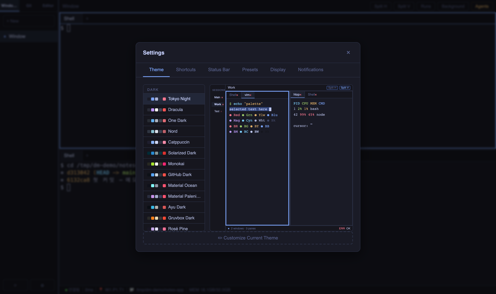

# Dongminal

**브라우저에서 쓰는 터미널 워크스페이스.** 서버에서 한 번 띄우면, 노트북에서도
아이패드에서도 같은 터미널·같은 창 배치로 이어서 씁니다. 창을 닫아도 세션은
살아 있습니다.

받아서 실행하면 끝입니다 — **의존이 없는 단일 파일**이고 Go 도, Node 도, 별도
설치도 필요 없습니다. 화면(xterm.js)과 헬퍼까지 그 안에 들어 있습니다.



---

## 설치

자기 OS 것 하나만 받으면 됩니다.

**macOS (Apple Silicon)**

```bash
curl -fL -o dongminal https://github.com/Biisairo/dongminal/releases/latest/download/dongminal-darwin-arm64
chmod +x dongminal && xattr -d com.apple.quarantine dongminal
./dongminal start
./dongminal window
```

Intel 맥이면 `darwin-arm64` 를 `darwin-amd64` 로 바꾸세요.

> `xattr` 한 줄이 필요한 이유는 코드 서명·공증을 하지 않았기 때문입니다. 건너뛰면
> macOS 가 **"개발자를 확인할 수 없어 열 수 없습니다"** 로 막습니다. 프로그램이
> 깨진 것이 아닙니다.

**Linux · WSL**

```bash
curl -fL -o dongminal https://github.com/Biisairo/dongminal/releases/latest/download/dongminal-linux-amd64
chmod +x dongminal
./dongminal start
```

ARM 이면 `linux-amd64` 를 `linux-arm64` 로.

**Windows 10 1809+** (PowerShell)

```powershell
curl.exe -fL -o dongminal.exe https://github.com/Biisairo/dongminal/releases/latest/download/dongminal-windows-amd64.exe
.\dongminal.exe start
.\dongminal.exe window
```

받은 파일이 맞는지 확인하려면 릴리스 페이지의 `SHA256SUMS` 를 함께 받아
`sha256sum -c SHA256SUMS --ignore-missing` 을 돌리면 됩니다.

---

## 처음 5분

**1. 띄웁니다.**

```bash
./dongminal start
```

`✅ dongminal running on http://127.0.0.1:58146` 가 뜨면 준비된 것입니다.
터미널은 돌려받습니다 — 서버는 뒤에서 계속 돕니다.

**2. 엽니다.** 브라우저에서 `http://localhost:58146` 으로 들어가거나,
`./dongminal window` 로 주소창 없는 창을 띄웁니다.

**3. 나눠 씁니다.** 상단의 `Split H` · `Split V` 로 화면을 가르고, 탭의 `+` 로
탭을 늘립니다. 왼쪽 `+ New` 는 새 창입니다 — 창은 서버에 남으므로 브라우저를
닫았다 열어도 그대로입니다.

**4. 다른 기기에서도 씁니다.**

```bash
./dongminal start --expose      # 0.0.0.0 에 바인드
```

같은 네트워크의 다른 기기에서 `http://<서버-IP>:58146` 으로 들어가면 됩니다.
**인증이 없으므로 신뢰하는 망에서만 쓰세요** — 사내망이나 Tailscale 같은
사설망을 권합니다.

**5. 멈춥니다.**

```bash
./dongminal stop        # 서버만 정지 (터미널 세션은 살아 있습니다)
./dongminal stop --all  # 세션까지 정리
```

---

## 할 수 있는 것

### 터미널 · 창 · 분할

가로·세로 분할, 탭, 창을 마우스로 끌어 재배치합니다. 배치는 서버에 저장되므로
브라우저를 닫아도, 다른 기기로 옮겨도 그대로 이어집니다. 자주 쓰는 배치는
**프리셋**으로 저장해 두고 한 번에 펼칩니다.

터미널 안에서 `dmctl` 로 워크스페이스를 조작할 수도 있습니다 — 새 창을 만들거나,
화면을 나누거나, 다른 탭으로 포커스를 옮기는 일을 명령으로 합니다.

### Git

왼쪽 `Git` 탭에 저장소를 추가하면 그 저장소 전용 창이 섭니다.



`Changes`(줄 단위 스테이징·커밋) · `Diff` · `History`(그래프) · `Branches` ·
`Stash` · `Console` · `Worktrees` 일곱 탭이 고정으로 붙습니다. 되돌릴 수 없는
동작은 **무엇이 사라지는지 세어 보인 뒤** 묻고, 되돌릴 수 있는 것은 `Undo` 를
줍니다.

### 편집기

`Editor` 탭에 경로를 추가하면 왼쪽 탐색기 · 오른쪽 편집기(Monaco)로 열립니다.
터미널에서 `edit <파일>` 을 쳐도 그리로 갑니다. 파일 찾기(`Cmd+P`)와 전체
검색(`Cmd+Shift+F`)이 있고, 탐색기는 git 상태를 색으로, `.gitignore` 대상을
흐리게 보여 줍니다.

### AI 에이전트와 함께

Claude Code·Codex 같은 에이전트를 터미널에서 돌릴 때, **보고 있지 않은 탭에서
작업이 끝나거나 입력을 기다리면 알려 줍니다.** 해당 탭과 창이 천천히 깜빡이고,
🔔 배지에 모여 클릭하면 그 자리로 이동합니다. 브라우저 탭 제목에도 개수가 붙고,
권한을 허용하면 OS 알림도 옵니다.

여러 에이전트를 동시에 돌린다면 오른쪽 `Agents` 패널이 **지금 각자 무엇을 하는지**
카드로 모아 보여 줍니다. 설정이 필요 없습니다 — 터미널 출력을 보고 판단하므로
어떤 CLI 든 동작합니다.

### 백그라운드 도구

탭을 닫아도 하던 작업을 계속 돌리고 싶으면 터미널에서 `detach` 를 칩니다. 상단
`Background` 버튼(`Ctrl+Shift+B`)에 모이고, 눌러서 아무 자리로나 되돌립니다.
tmux 의 detach 와 같은 생각입니다.

### 파일 주고받기

터미널이나 탐색기에 파일을 **끌어다 놓으면** 올라갑니다. 폴더를 놓으면 하위
구조까지 그대로 올라가고, 내려받을 때는 zip 으로 옵니다. 터미널에서
`download <경로>` 로도 받습니다.

### 테마와 설정



테마 44종(다크 33 · 라이트 11)과 커스텀 편집기가 있습니다. 단축키는 전부 바꿀 수
있고, 하단 상태 표시줄에 무엇을 띄울지도 고릅니다. 브라우저 탭 이름을 바꿔 두면
여러 대를 띄웠을 때 어느 것이 어느 기계인지 탭 줄에서 갈립니다.

---

## 자주 쓰는 단축키

| 하는 일 | 키 |
|---|---|
| 가로 · 세로 분할 | `Ctrl+Shift+H` · `Ctrl+Shift+V` |
| 새 창 · 새 탭 | `Ctrl+Shift+N` · `Ctrl+Shift+T` |
| 탭 이동 | `Ctrl+Tab` · `Ctrl+Shift+Tab` |
| 분할 칸 이동 | `Ctrl+Shift+←↑↓→` |
| 터미널 검색 | `Ctrl+F` (맥은 `Cmd+F`) |
| 백그라운드 도구 · 에이전트 패널 | `Ctrl+Shift+B` · `Ctrl+Shift+A` |
| 내부 새로고침 | `Ctrl+Shift+K` |

전부 **설정 → Shortcuts** 에서 바꿀 수 있습니다. 자세히는
[단축키 문서](docs/external/shortcuts.md).

---

## 잘 안 될 때

**터미널이 뜨지 않거나 비어 보이면** 먼저 이것을 돌립니다.

```bash
./dongminal doctor
```

셸 선택, 의사 터미널 기동, 로컬 통신, 프로세스 제어를 **계층별로 실제 실행해서**
어디서 막혔는지 그대로 보여 줍니다. 증상만으로 추측하지 않아도 됩니다.

**에이전트 훅이 `dmctl: No such file or directory` 로 실패하면** 설치된 헬퍼가
깨진 것입니다.

```bash
./dongminal health
```

가 그 사실을 알려 주고, 서버를 다시 띄우면 다시 설치됩니다.

### 알려진 문제

- **원격 접속이 한 번씩 끊깁니다 — 원인 미확정.** 가설 넷(임시 포트 고갈·절전·IP
  변동·고아 데몬)을 실측으로 기각했습니다. 밝혀진 실제 결함이던 재연결 폭주는
  1.0.1 에서 멎었고, 서버가 1분마다 남기는 진단 줄이 다음 발생 때 원인을 가릅니다.
  조사 기록은 [여기](docs/internal/CONNECTIVITY_INVESTIGATION.md).

---

## 더 읽을 것

- [설치·실행 자세히](docs/external/getting-started.md) — 환경 변수, 격리 실행, 헬퍼 배포
- [기능 전반](docs/external/features.md) — 창·터미널·Git·편집기·표시 설정
- [터미널 안 명령](docs/external/commands.md) — `dmctl` · `edit` · `download` · `detach`
- [단축키](docs/external/shortcuts.md)
- [에이전트 오케스트레이션](docs/external/agent-orchestration.md)
- [HTTP·WebSocket API](docs/external/api.md)
- [변경 이력](CHANGELOG.md)

---

## 고치려는 분께

빌드·검사·배포·테스트는 [docs/internal/building.md](docs/internal/building.md) 에
있습니다. 설계는 [docs/internal/architecture.md](docs/internal/architecture.md),
기능별 명세는 [docs/internal/](docs/internal/) 아래에 있습니다.

README 의 그림은 `scripts/shots/shoot.sh` 가 다시 찍습니다 — 격리 인스턴스를
띄워서 찍으므로 개인 정보가 섞이지 않습니다.
