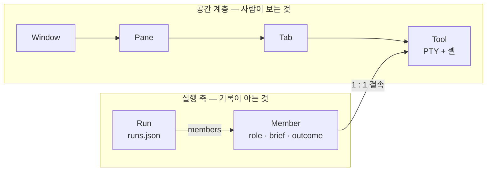
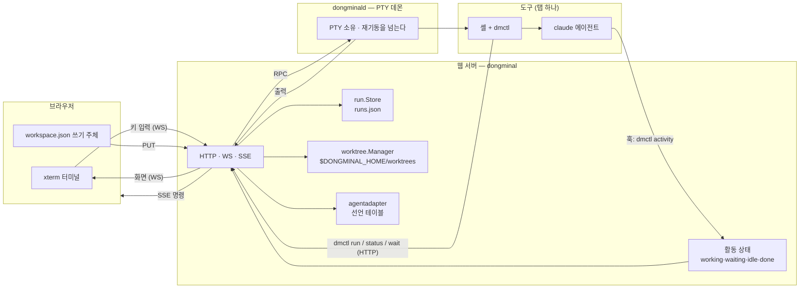
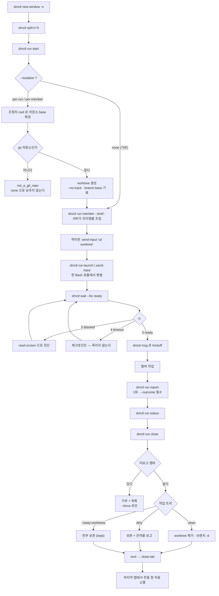
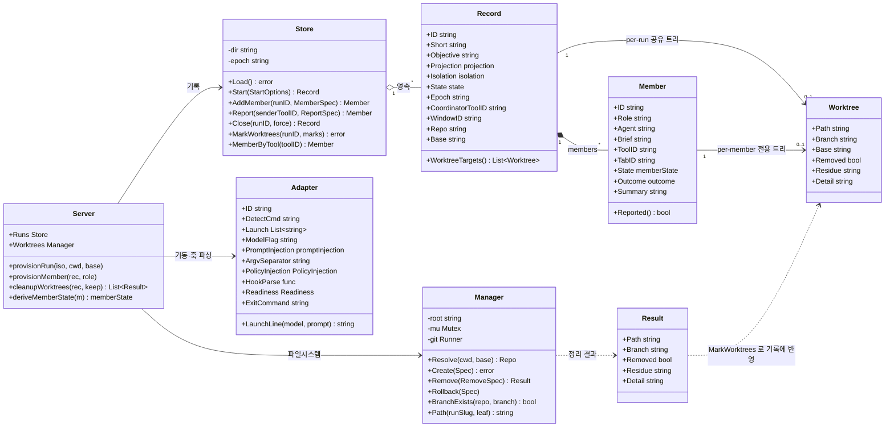
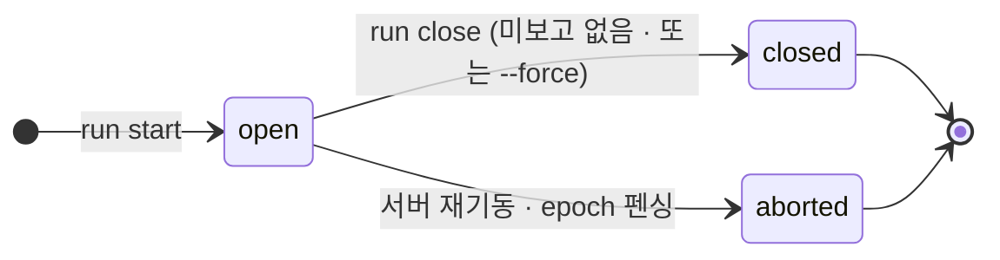
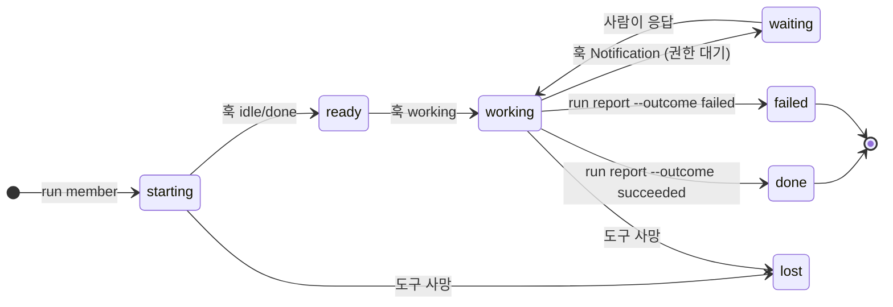

# 아키텍처

## 프로세스 역할 넷

바이너리는 하나인데 **프로세스 역할은 넷**이다. `main()` 이 argv 로 갈라진다.

```
Browser (xterm.js)                    ┌─ ② dongminald ─────────────┐
   │  Binary WebSocket                │   PTY 소유 · ToolManager    │
   ├────────────────────▶ ③ dongminal │   브라우저 새로고침에도 유지 │──▶ Shell
   │                       (웹 서버)  └────────────┬───────────────┘
   └─ SSE /api/commands/sse ◀── HTTP/WS/SSE        │ Unix socket
                                  │               │ (paned.sock)
                                  ↕               ↕
                          DONGMINAL_HOME/
                            ├ settings.json
                            ├ workspace.json   (schemaVersion 2)
                            ├ tools.json
                            └ bin/ ──▶ ① dmctl / edit / download / detach
                                       (같은 바이너리의 multi-call symlink)

④ dongminal start|stop|health|migrate   — 제어 CLI. ③ 을 띄우고 접는다
```

데몬이 PTY 를 들고 있어서 웹 서버를 재시작해도 터미널 세션이 살아남는다. 데몬이
없으면 ③ 이 자기 프로세스에 ToolManager 를 만든다(direct mode) — 그래서
`shared/toolhub` 를 ②③ 이 함께 실행한다.

- 프론트엔드는 `go:embed` 로 바이너리에 포함.
- 런타임 헬퍼(`dmctl`, `edit`, `download`, `detach`)는 multi-call CLI — `$DONGMINAL_HOME/bin/` 에 바이너리를 가리키는 symlink 로 설치된다. zsh/bash cwd 훅은 `go:embed` 로 풀린다. 각 터미널의 shell 은 자동으로 이 경로를 `PATH` 에 얹고 `ZDOTDIR`/`BASH_ENV` 로 훅 연결.
- PTY 프로세스는 브라우저 새로고침해도 유지 (서버 메모리 버퍼).
- 워크스페이스(창/분할 칸/탭) 는 `workspace.json` 에 비동기 영속화 (H5 latest-wins coalescing). 탭이 참조하는 도구는 `tools.json` 에 기록되고, 백그라운드 도구는 기록되지 않아 데몬 재시작을 넘기지 않는다.
- 에이전트 접합면: 액션은 `dmctl` 서브커맨드, 정책은 `--plugin-dir`/`--settings` 로 세션 스코프 주입되는 스킬·훅. 등록 절차 없음. 자세히는 [docs/external/agent-orchestration.md](docs/external/agent-orchestration.md).
- 주의 알림: 서버가 도구 출력을 관찰(OSC 9/99/777·idle)하거나 `dmctl notify`(claude/codex 투명 래퍼가 자동 주입한 hook 이 호출)로 주의 상태를 잡아 SSE(`tool_attention`) 로 브라우저에 전달. 자세히는 [docs/internal/archive/PANE_ATTENTION_NOTIFY_SRS.md](docs/internal/archive/PANE_ATTENTION_NOTIFY_SRS.md).
- 에이전트 활동: attention 과 직교하는 "현재 작업 상태(activity)" 레이어. 에이전트 hook 이 `dmctl activity` 로 보고(stdin hook JSON 파싱) → `POST /api/tools/activity/set` → SSE(`tool_activity`) 발행. 도구당 최신 1개 상태만 보관(히스토리 없음). 자세히는 [docs/internal/archive/AGENT_ACTIVITY_PANEL_SRS.md](docs/internal/archive/AGENT_ACTIVITY_PANEL_SRS.md).

자세한 패키지 구조와 핫패스 성능 설계는 [docs/internal/architecture.md](docs/internal/architecture.md).

*(위 그림은 README 가 사용자 문서가 되면서 옮겨 온 것이다 — README_REWRITE_SRS
FR-RDM-10.)*

## 패키지 레이아웃

`internal/` 은 **프로세스 축**으로 묶여 있다. 판정 기준은 "링크되냐"가 아니라
**"어느 프로세스가 실제로 실행하냐"** 다 — 단일 바이너리라 링크 클로저는 네 프로세스가
모두 같아서 그것으로는 아무것도 갈리지 않는다. 둘 이상이 실행하는 것만 `shared/` 다.
근거와 실측은 [PACKAGE_RESTRUCTURE_SRS.md](./PACKAGE_RESTRUCTURE_SRS.md) §2.1.

```
cmd/dongminal/           # composition root (main) — 진입점 판별 + 의존 조립
internal/
  helper/                # ① dmctl/edit/download/detach 프로세스
    runtimebin/          #   multi-call CLI 구현 (dmctl notify·activity 포함)
    toolline/            #   dmctl 공용 한 줄 렌더러 (byte-level 동일 출력 보장)
  daemon/                # ② dongminald 프로세스 — PTY 를 소유한다
    boot/                #   데몬 진입점 (Run). 웹 서버를 재시작해도 세션이 살아남는 이유
    ipc/                 #   PanedServer — Unix socket accept 루프 (연결 하나를 직렬 처리)
  webserver/             # ③ 웹 서버 프로세스
    httpapi/             #   HTTP/WS/SSE 라우팅 + settingsStore + 잔여 핸들러 (Server)
    gitapi/              #   /api/git/* 핸들러 74개 (GitServer). 라우트 테이블을 스스로 소유
                         #     gitwrite.go — 쓰기 한 번의 순서를 타입이 강제한다
    apierr/              #   sentinel → (status, code) 등록부 + 와이어 코드 단일 소유
    hub/                 #   CommandHub·SSE 브로커 · FocusRegistry · AttnTracker
    toolclient/          #   ToolClient — 데몬에 붙는 IPC 클라 (재접속 supervisor 포함)
    seam/
      adapters/          #     toolaccess 인터페이스 ↔ 구체 타입 브리지
      toolaccess/        #     도구(PTY)·워크스페이스·커맨드 허브 접합면 인터페이스
      clientpid/         #     원격 TCP(remoteAddr) → client PID (ps/lsof)
    domain/
      git/               #     git 실행의 유일한 경로. 아래 5패키지 (§git 절)
        core/            #       Service + 두 초크포인트(Exec, ExecWrite) + guard·errors·record
        query/           #       조회 — Exec 만 쓴다
        write/           #       변경 — ExecWrite 만 쓴다
        store/           #       TTL + single-flight 캐시
        jobs/            #       원격 작업(fetch/pull/push) 잡 큐
      run/               #     Run 레코드 — runs.json + 투영/격리 타입 + 멤버 프리앰블
      worktree/          #     Run 격리의 git worktree 생성·정리 + 안전 가드
      sysstat/           #     상태바 지표를 커널에서 직접 읽는다 (cgo 격리)
  ctl/                   # ④ 제어 CLI 프로세스
    cli/                 #   start/stop/health/migrate 디스패치 + 옵션 해석
    migrate/             #   v1 → v2 엔티티 스키마 1회성 변환
  shared/                # 둘 이상의 프로세스가 실행한다
    workspace/           #   ①②③ — workspace.json 인덱싱·resolve·영속화
    uuid/                #   ②③④ — 엔티티 uuid(UUID v7) 생성·파싱
    toolhub/             #   ②③  — ToolManager·PTY·브라우저 WS·주의 알림 탐지(OSC/idle)
    toolipc/             #   ②③  — paned 와이어 포맷만 (25줄)
    outbuf/              #   ②③  — PTY 출력 바운디드 버퍼 (Stream)
    runtime/             #   ②③  — helper symlink 설치 + 셸 훅 embed + agent-hooks 생성
      shellhooks/        #     bash-hook.sh, zdotdir/.zshrc (실제 파일)
      agentplugin/       #     세션 스코프 주입 플러그인 (skills/team, skills/workflow)
    agentadapter/        #   ①③  — 에이전트별 선언 테이블 (기동·탐지·주입·훅 파서·종료)
web/                     # 프론트엔드 자산 + embed.FS()
  js/core/               #   App 클래스 (app.js + 주제별 app-*.js 17) + helpers·main
                         #     constants{,-git,-editor}.js — 주제별 상수 (로드 순서가 그 순서)
  js/ui/                 #   themes·renderer·term-pane·term-clipboard·file-tree·file-editor 등 12
  js/git/                #   git 패널 15파일. api.js — gitFetch/gitPost (stale·echo 가드 소유)
e2e/                     # Playwright 스펙 + git 픽스처(git_fixture.sh)
scripts/                 # build.sh — 빌드 · verify-isolated.sh — `dongminal verify` 껍데기
.github/workflows/       # verify.yml — 매 푸시 검사 (Linux·Windows)
                         # release.yml — 태그 v* → 5개 대상 빌드 → GitHub Releases
                         #   운영 동작은 바이너리의 액션 (internal/ctl/cli)
docs/
  internal/              # 개발자 문서 (이 파일)
  external/              # 사용자 문서
```

**프로세스 축에 예외는 없다.** 마지막까지 축 밖에 있던 `internal/server` 가
`internal/webserver/httpapi` 로 들어오면서 모든 패키지가 네 프로세스 중 하나 또는
`shared/` 에 속한다. 판정 기준은 링크 클로저가 아니라 **실행**이다 — 단일 바이너리라
클로저는 네 프로세스가 모두 같고, 그것으로는 아무것도 갈리지 않는다.

`httpapi` 안의 핸들러는 **무엇을 손볼 때 함께 봐야 하는가**로 갈라 뒀다.
`handlers_files.go` 가 경로를 사용자 입력에서 받는 유일한 면이고(`safeResolve`·
`uniquePath` 가 여기 있다), `handlers_attention.go` 는 같은 `AttnTracker` 상태를 읽는
종단 8개, `handlers_settings.go` 는 서버가 해석하지 않는 JSON blob 이다.
`handlers_api.go` 에는 라우트 테이블과 디스패처가 남는다.

**프론트엔드는 번들러가 없다.** `index.html` 이 `<script>` 로 원본을 순서대로 로드하므로
**로드 순서가 곧 의존성**이다. `app-*.js` 는 `Object.assign(App.prototype, …)` 로 클래스를
확장하므로 `app.js` 뒤, `main.js` 앞이어야 한다. `app.js` 본체에 남은 접근자 11개는
`Object.assign` 이 getter 를 값으로 복사하기 때문에 옮길 수 없다.

## 오류 응답 — 판정은 한 곳, 렌더링은 표면마다

이 서버에는 오류 본문 **방언이 넷** 있고 각각이 브라우저가 소비하는 공개 계약이다:

| 방언 | 본문 | 쓰는 곳 |
|---|---|---|
| git | `{"error": <코드>, "message": <tail>}` | `/api/git/*` |
| fs | `{"code": <코드>, "message": <msg>}` | `/api/fs/*` · `/api/editors/*` |
| runs | `{"error": <sentinel 문자열>, "detail": <err>}` | `/api/runs/*` |
| 단문 | `{"error": <msg>}` | `/api/tools/{output,input,message}` · `/api/whoami` |

**통일하지 않는다** — 그것은 리팩터가 아니라 파괴적 변경이다. 대신
`internal/webserver/apierr` 가 **매핑과 어휘**를 소유하고 렌더링은 각 표면에 남는다
(DEEPENING_REFACTOR_SRS 묶음 A).

```
domain sentinel 78개 ──▶ apierr.{Git,Runs,FS}.Lookup ──▶ (status, code)
                                                            │
                     각 표면의 렌더러가 자기 본문 모양으로 싣는다
```

**테이블이 표면마다 하나인 이유** 는 같은 sentinel 의 옳은 상태 코드가 표면마다
다르기 때문이다:

```
worktree.ErrNotRepo → /api/git/worktrees  404  (지목한 것이 거기 없다)
                    → /api/runs           400  (호출자가 인자로 준 것이 틀렸다)
```

기계(`Table.Lookup`)는 공유하고 정책(테이블)은 표면이 갖는다.

**전수성이 강제된다.** `apierr/inventory.go` 가 HTTP 에 도달할 수 있는 sentinel
전부를 열거하고, 테스트가 "규칙이 있거나 사유와 함께 면제됐다"를 검사한다. 새
sentinel 을 더하고 둘 중 아무것도 하지 않으면 실패한다 — **조용히 500 이 되는
경로가 구조적으로 없다.**

## git 쓰기의 순서는 타입이 쥔다 (`gitapi/gitwrite.go`)

쓰기 핸들러는 `gitWrite` 를 지난다. 실패가 **끈적해서**(sticky) 한 번 응답한 뒤의
모든 단계가 무동작이므로, 핸들러에 `if !ok { return }` 이 없다:

```go
var req gitDiscardReq
t := s.beginWrite(w, r, &req)          // Git nil 검사 + 본문 디코드
t.requireConfirm(true, req.Confirm, …) // FR-GIT-89
t.resolve(req.Repo)                    // FR-GIT-62
t.apply(func(ctx context.Context) error { … })  // 실행 전 status 를 스스로 찍는다
t.ok(nil)                              // 실행 후 status 를 함께 싣는다 (FR-GIT-71)
```

`snapshot()` 은 멱등이고 `apply` 가 부르지 않았으면 스스로 부른다 — **"실행 전
status 를 빼먹는" 경로가 없어야** 부분 적용 판정(FR-GIT-73)이 성립한다.

표준형에 맞지 않는 것은 **억지로 넣지 않는다.** 응답에 오류값 밖의 데이터를
실어야 하는 자리(부모 목록·stash 잔존·Publish 계획·preflight 전문)는 제자리에
남았고, 그 목록과 사유는 SRS §7.2 에 있다.

## 프론트엔드 git 조회 (`web/js/git/api.js`)

서버가 응답마다 `requested` 를 되싣는 이유는 하나다 — 늦게 온 남의 응답을 자기
것으로 읽지 않는 것(FR-GIT-16). 그 **echo 검증**을 `gitFetch` 가 소유한다:

```js
const res = await gitFetch('/api/git/stash', {repo},
  {stale: () => this.panel.isStale(tok), echo: {repo}});
if (res.stale) return;          // 조용히 나간다 — 남의 응답이다
if (!res.ok)   { …사유를 보이고 이미 받은 목록은 지우지 않는다… }
```

반환값이 셋(성공·stale·실패)인 이유는 호출자가 셋에 **다르게** 반응하기
때문이다. null 하나로 접으면 stale 이 실패로 보이고, 리포를 빨리 바꿀 때마다
오류가 번쩍인다.

`requested` 의 모양이 종단마다 문자열/객체 둘이라 `gitEchoOk` 가 둘 다 받는다.
**`d.repo` 로 비교하지 않는다** — 그것은 서버가 정규화한 루트라 보낸 값과 다를 수
있고, 그것으로 짝을 맞추면 목록이 영원히 실패로 남는다.

`internal/` 는 Go 언어 레벨에서 외부 import 를 막아 캡슐화를 강제한다. 외부 의존성이 필요한 모듈은 의도적으로 `internal/` 밖(현재는 `web/` 만 해당)으로 뺀다.

## 런타임 헬퍼 배포 (`internal/shared/runtime`)

`runtime.Install(binDir)` 이 `main()` 초기화에서 `$DONGMINAL_HOME/bin/` 을 채운다.

**helper CLI** 는 `internal/helper/runtimebin` 의 multi-call dispatch 로 dongminal 바이너리 자체가 처리하므로, `bin/<name>` 은 실행 파일을 가리키는 symlink (미지원 환경에선 복사) 다. `runtimebin.HelperNames()` 가 단일 소스:

- `dmctl` — `/api/commands` 로 워크스페이스 action 브로드캐스트 + `list-workspace`/`who-am-i`/`notify`/`activity` + 에이전트 접합면(`read-screen`/`send-input`/`msg`/`status`/`wait`/`run`). 아래 "에이전트 접합면과 Run" 절.
- `edit` — `POST /api/commands` 로 `openEditorTab` 브로드캐스트 (내장 편집기 탭).
- `download` — OSC 777 `Download;<abs>` 출력.
- `detach` — 현재 도구를 백그라운드로 보내고 탭을 닫는다 (`--list` / `--restore <id>`).

**셸 훅** 은 shell 문법이 필수라 임베드 파일을 그대로 풀어둔다:

- `bash-hook.sh` — `PROMPT_COMMAND` 에 `_rt_cwd_hook` 주입, OSC 777 `Cwd;<pwd>`.
- `zdotdir/.zshrc` — zsh 용 `precmd`/`chpwd` 훅. `~/.zshrc` 를 먼저 source.

**agent-hooks** — `installAgentHooks` 가 `bin/agent-hooks/` 에 Claude Code hooks settings 를 생성한다. hook 커맨드는 `dmctl` 을 절대경로로 참조해, PATH 앞쪽의 낡은 `dmctl` 이 `notify` 를 모르는 사고를 막는다.

도구 스폰 시 `StartTool` 이 환경을 덧붙인다 (`internal/shared/toolhub/tool.go`):

```
PATH=<기존>:$DONGMINAL_HOME/bin
zsh  → ZDOTDIR=$DONGMINAL_HOME/bin/zdotdir
bash → BASH_ENV=$DONGMINAL_HOME/bin/bash-hook.sh
TERM=xterm-256color, COLORTERM=truecolor, LANG/LC_ALL/LC_CTYPE=en_US.UTF-8
DONGMINAL_PORT=<서버 포트>   # main() 이 setenv, 자식 PTY 가 상속
DONGMINAL_TOOL_ID=<도구 id>  # detach 가 자기 도구를 식별하는 근거
```

## 편집기 — Editor 탭과 Editor 창 (`EDITOR_TAB_SRS`)

**편집기는 일반 창에 열리지 않는다.** 경로마다 하나씩 서는 **Editor 창**에만 산다
(FR-EDT-94). 그 창은 좌측에 파일 탐색기를, 우측에 편집기 영역을 갖는다.

```
사이드바 탭:  Windows · Git · Editor
Editor 탭:    [일반 행들 …] ── 구분선 ── [root 행 `~`]   ← 최하단 고정, 삭제 불가
행 하나  =  창 하나 (`WINDOW_TYPE_EDITOR`, `editor.root`)
```

**행과 창은 재조정(reconcile)으로 맞춘다** (FR-EDT-42). 있어야 할 루트 집합은
`[home, ...editors.list]` 이고, 재조정은 **멱등**이며 같은 루트의 창이 둘이면 id
사전순으로 하나만 남긴다. 창을 만드는 주체가 브라우저인데 목록 변경은 SSE 로 모든
브라우저에 도달하므로, 결정론적 중복 제거가 단일 실행자 지명
(`singleExecutorActions`)의 자리를 대신한다.

**`layout` 이 없는 Editor 창은 살아남는다.** 로드·SSE 동기화의 창 필터가
`s.layout || s.type === 'editor'` 다 (`app.js`·`app-cmd.js`). 갓 만든 Editor 창은
탐색기만 있고 pane 이 **없는** 것이 정상 상태이기 때문이다 (FR-EDT-55).

**분할은 드래그드롭뿐이다** (FR-EDT-50·51). 단축키·버튼 분할이 없으므로 빈 pane 이
생길 경로가 없고, pane 은 언제나 탭을 하나 이상 갖는다. 탭은 **같은 Editor 창
안에서만** 옮겨진다 — 게이트는 창 경계를 넘는 두 자리(`app-dnd.js` 의
`_moveTabToWindow` 출발·도착)에만 있다. 창 **안**의 이동(`_moveTabToPane`)과 드롭
분할(`_splitPaneWithTab`)에 조건을 더하면 유일한 분할 수단이 함께 막힌다.

**Git 핀과 Editor 행은 서로를 만들고 지운다** (FR-EDT-31~38a). 그 연동은
`internal/webserver/domain/wsentry` 가 **한 번의 read-modify-write** 로 수행한다 —
두 목록이 따로 저장되면 그 사이에 다른 브라우저가 절반만 반영된 상태를 본다. 홈은
네 방향 모두에서 무동작이다(root 행이 이미 그 경로를 대표한다). 규칙 넷은 순수
함수이며 서로를 호출하지 않는다 — AST 검사가 그것을 강제한다.

**파일 라우팅.** `edit <path>` 는 그 경로를 루트 아래에 포함하는 창(둘 이상이면 가장
깊은 것), 없으면 root 에디터로 간다. Git 의 `Open File` 은 **파일이 아니라 활성 리포
경로**로 창을 고른다 — `Open File (HEAD)` 의 임시 파일은 저장소 밖에 있어 파일로
고르면 틀린다.

### 서버 표면

| 종단 | 쓰임 |
|---|---|
| `GET /api/file/read?path=<abs>` · `POST /api/file/write` | Monaco 의 파일 I/O (기존) |
| `GET /api/fs/list?root=&path=` | 탐색기 한 겹 조회. dot 항목 포함 전량, 정렬은 서버가 한다 |
| `POST /api/fs/{create,rename,delete}` | 파일 조작. **`root` 를 함께 받아 그 아래로 제한한다** |
| `GET /api/editors` · `POST /api/editors/{add,remove,reorder}` | Editor 목록. 응답에 `pinned` 를 함께 싣는다 |

조작 종단이 `root` 를 요구하는 이유는 기존 `/api/file/*` 의 가드가
`safeResolve("/", …)` 라 **사실상 무제한**이기 때문이다. 읽기·쓰기는 사용자가 경로를
지목한 것이지만 조작은 트리 탐색에서 파생된 경로를 지운다. 그리고 루트 경계 판정에
`safeResolve` 를 **재사용하지 않는다** — 그쪽은 `..` 접두 문자열로 판정해 `..b`·`...`
같은 정상 이름을 이탈로 오인한다.

도구 타입은 `terminal` 과 `editor` 두 가지다 (`web/js/core/helpers.js` 의 capability 맵). `editor` 는 `backgroundCapable=false` 이므로 detach 대상이 아니다 (FR-BG-11).

과거의 code-server 통합(`internal/server/codeserver.go`, `/cs/<id>/` 리버스 프록시, `CodeServerManager`)은 `8dc0a3f` 에서 이 내장 편집기로 대체되며 제거됐다.

## 사이드바 탭 (`web/js/ui/sidebar-tabs.js`)

좌측 사이드바는 `Windows`·`Git`·`Editor` 세 목록을 세로로 쌓지 않고 **탭으로
가른다** (`GIT_SIDEBAR_TABS_SRS`, `EDITOR_TAB_SRS`). 한 번에 하나만 보이고, 보이는
쪽이 사이드바의 남은 높이 전부를 쓴다.

**새 탭을 더하는 비용은 서술자 1개다** (FR-SBT-21). `sidebar-tabs.js` 의
`SB_TAB_DEFS` 배열에 한 항목을 넣고 `index.html` 에 패널 래퍼(`<div class="sb-panel"
id="sb-panel-…">`) 하나를 두면 끝이다. 아래 넷이 그 배열에서 **파생**되므로 따로
열지 않는다.

| 파생되는 것 | 어디서 |
|---|---|
| 탭 버튼과 순서 | `SidebarTabs.paint` — `index.html` 의 `#sb-tabs` 는 비어 있다 |
| 목록 렌더 호출 | `renderer.js` 의 `_rLists` 가 `list` 를 가진 서술자를 **순회**한다. 예전에는 탭 id 두 개가 하드코딩돼 있었고, 셋째 탭이 그것을 드러냈다 |
| 직행 키 `Ctrl+Shift+{n}` | 배열 인덱스. `SHORTCUT_DEFAULTS`·`SHORTCUT_LABELS`·`shortcuts` 를 로드 시점에 함께 채운다 |
| `executeAction` 의 `sidebarTab{n}` | `app.js` 가 배열을 돌며 만든다 |
| 설정 화면의 단축키 목록 | `app-settings.js` 의 `사이드바 탭` 그룹 |

서술자의 훅은 `app` 을 인자로 받는다 — 배열이 모듈 수준 상수여야 단축키 등록이 App
인스턴스보다 먼저 돌 수 있기 때문이다 (로드 순서상 `sidebar-tabs.js` 는 `app.js`
앞이다).

`onActivate`·`cycle` 이 이 탭을 **조작**으로 만든다. 탭을 고르면 콘텐츠 창이 따라
바뀌고(FR-SBT-22), 창이 바뀌면 탭이 따라온다(FR-SBT-14). 두 방향이 서로를 부르므로
`_sbBusy` 가 재진입을 한 번에 끊는다. 순회 키(`Ctrl+Shift+[ ]`)는 새 키를 만들지 않고
**활성 탭의 `cycle`** 로 디스패치된다 (`app-layout.js` 의 `_cycleActive`).

## 에이전트 접합면과 Run

도구 안에서 도는 에이전트가 워크스페이스를 조회·조작하는 경로다. **액션은 `dmctl`
서브커맨드, 정책은 세션 스코프로 주입되는 스킬**이며 MCP 는 없다
(`SKILL_INJECTION_SRS`). 셸만 있으면 되므로 에이전트 종류에 매이지 않는다.

| 엔드포인트 | dmctl | 쓰임 |
|---|---|---|
| `GET /api/tools/output` | `read-screen` / `read-output` | 다른 도구의 화면·출력 |
| `POST /api/tools/input` | `send-input` | 붙여넣기(bracketed paste + 120ms submit) |
| `POST /api/tools/message` | `msg` | 에이전트 간 신뢰 엔벨로프 |
| `POST /api/tools/activity/set` | `activity` (훅 브리지) | 에이전트 상태 보고 |
| `GET /api/tools/activity/get` | `status` | 그 도구의 에이전트 상태 |
| `GET /api/tools/activity/wait` | `wait --for ready\|done` | 상태 대기 (**서버 long-poll**) |
| `POST /api/runs`·`/members`·`/report`·`/close`, `GET /api/runs` | `run …` | 실행 기록 |
| `GET /api/runs/preamble` | `run launch` | 멤버 프리앰블 조회·재조회 |

**준비완료 판정은 화면이 아니라 훅이다.** `dmctl activity` 가 보고한
`working/waiting/done/idle` 이 1차 근거이고, 훅이 없는 에이전트만 "출력이 3초 정적"
폴백으로 판정한다. `waiting`(권한 확인 대기)은 준비완료가 아니라 `blocked` 로 즉시
반환한다 — 시간이 지난다고 풀리지 않기 때문이다. 타임아웃은 실패가 아니라
체크포인트다 (`RUN_ORCHESTRATION_SRS` 묶음 S).

**Run 은 공간 계층과 직교한 실행 축**이다 (`internal/webserver/domain/run`). `runs.json` 에 영속되며,
서버 기동마다 발급하는 epoch 로 이전 세대가 열어둔 Run 을 로드 시 `aborted` 로
확정한다 — 백그라운드 도구가 재기동을 넘지 못하므로 되살릴 실체가 없다. 멤버 상태는
저장하지 않고 **조회 시점에 파생**한다(도구가 죽었으면 `lost`, 훅 상태가 그대로).
단 보고를 마친 멤버는 기록이 관측을 이긴다.

보고(`run report`)의 권한은 **발신 도구의 정체**다 — 페이로드에 실린 id 를 아는 것은
권한이 아니다. PID 부모 체인 해석이 우선이고 `DONGMINAL_TOOL_ID` 는 daemon 모드
폴백이다.

`Tab.runId` · `Window.ownerRunId` 표식은 **best-effort** 다. `workspace.json` 의 쓰기
주체는 브라우저이고 그쪽 409 처리가 머지 없이 재PUT 이므로 동시 편집에 지워질 수
있다. 소유권의 진실은 `runs.json` 이다.

## 오케스트레이션 다이어그램

아래 넷은 산문이 이미 말한 것을 **그림으로 다시 말하지 않는다** — 글로는 조립해야만
보이는 것(축의 직교성, 소유 경계, 판단이 갈리는 분기, 타입 간 결속)만 담았다.

### 축 — Run 은 계층의 레벨이 아니다



계층으로 만들면 "공간을 차지하지 않고 백그라운드로만 도는 팀"을 표현할 수 없다.
투영(`dedicated-window` | `background` | `inline`)이 선택인 이유가 이것이다. Member 와
Tool 의 1:1 결속은 보고 권한의 근거이기도 하다 — 한 도구는 열린 Run 하나에만 속한다.

### 프로세스 경계 — 누가 무엇을 소유하는가



에이전트가 서버에 말을 거는 통로는 **도구 셸의 `dmctl` 하나**다. 상태의 원천은 훅이고,
화면은 진단에만 쓴다.

### 팀 한 바퀴 — 판단이 갈리는 두 분기



기동부터 Kickoff 까지는 **하나의 어시스턴트 턴** 안에서 끝나야 한다. 그리고 `brief` 는
기동 프롬프트에 실리므로 멤버는 뜨자마자 시작한다 — 팀원 간 협업 지시를 brief 에 담으면
상대가 아직 없을 때 송신해 데드락이 된다.

### 타입 — 세 패키지가 각자 하나씩만 안다



`Worktree` 가 기록과 파일시스템의 접점이다 — 생성 시 경로·브랜치·base 를 받고, 정리 뒤에는
`Removed`·`Residue` 가 채워져 `run status` 가 나중에도 잔여물을 말한다.

### 상태 — 무엇이 권위인가





멤버 상태는 대부분 조회 시점에 파생되고, **보고는 기록이 관측을 이긴다** — 보고를 마친
멤버는 프롬프트로 돌아가 유휴가 되어도 `done` 이다. `waiting` 은 준비완료가 아니다.

## 에이전트 어댑터 레지스트리 (`internal/shared/agentadapter`)

에이전트별 지식은 **선언 테이블 하나**다. 전에는 훅 파서가 `dmctl_activity.go` 의
`switch agent` 에 박혀 있었고, 기동 커맨드·정책 주입 방식·종료 지시는 **코드에 아예
없이 스킬 산문에만** 있었다 — 산문이 코드와 갈라져도 아무도 몰랐다.

필드는 `id` / `detectCmd` / `launch` / `modelFlag` / `promptInjection` /
`policyInjection` / `hookParse` / `readiness` / `exitCommand` 다. **정책은 담지
않는다** — "무엇을 왜 어떤 순서로"는 스킬의 몫이고, 레지스트리는 "이 에이전트를
어떻게 띄우고 어떻게 상태를 읽는가"만 답한다.

알 수 없는 에이전트 id 는 **명확한 오류**다. 기본 에이전트로 조용히 폴백하지 않는다.
예외는 `dmctl activity <agent>` 하나 — 에이전트 훅으로 도므로 비0 종료가 사용자의
도구 호출을 막는다. 그 경로만 stderr 로 말하고 rc=0 을 지키며, 기록에 들어가는
통로(`run member` · `POST /api/runs/members`)는 rc=2 / 400 으로 거부한다.

**검증 대상은 Claude Code 다.** codex 선언은 유지하되 best-effort 이며, 확인하지
못한 값(모델 플래그·종료 지시·위치 인자 프롬프트)은 추측해 채우지 않고 비워 둔다 —
틀린 플래그는 기동 자체를 깨뜨려 없는 것보다 나쁘다. codex 의 표준 notify 는
`agent-turn-complete` 하나뿐이라 준비완료를 훅으로 알 수 없고(`readiness.hooks=false`),
출력 3초 정적 폴백으로 판정된다.

정책 주입은 **세션 스코프**다. 실제 주입기는 `internal/shared/runtime` 의 셸 래퍼이고,
그 래퍼가 레지스트리 선언과 어긋나지 않는지는 `internal/shared/runtime` 의 대조 테스트가
지킨다 — 이 대조가 없으면 선언은 아무도 읽지 않는 산문으로 되돌아간다.

`readiness.screenPatterns` 는 준비완료 판정 사다리 2단계의 자리지만 **소비자가
없다.** 의도적 보류다 — 화면 패턴은 사용자가 하단 스테이터스라인 하나만 붙여도
깨지며, 그것은 team 스킬의 `╭─`·`Thinking...` fingerprint 를 없애려는 이유와 같은
취약성이다.

## 멤버 프리앰블 (`internal/webserver/domain/run/preamble.go`)

멤버 기동 시 주입하는 역할·프로토콜 지시문이며 **평문**이다. 구조화 페이로드가
아니라, 실제 실행할 `dmctl` 예제에 Run·Member uuid 를 박아 넣은 텍스트를
`send-input` 으로 붙여넣는다. 행동 규칙은 **각 예제 바로 위**에 둔다 — LLM 독자는
예제에 정박하고 뒤따르는 산문은 훑는다.

**조립 주체는 서버다.** 멤버 생성 시점에 Run·Member uuid·조정자·worktree 를 이미
전부 알고 있어 조정자가 uuid 를 옮겨 적을 일이 없고, 프리앰블에 적힌 규칙은 서버가
실제로 강제하는 계약(1회 보고·outcome 필수·발신자 정체 권한)의 문장화라 강제 코드와
같은 패키지에 있어야 갈라지지 않는다. 역할 본문(`--brief`)만 정책이라 스킬이 넣고
서버가 합성한다.

`brief` 는 Member 레코드에 영속한다. 프리앰블이 **재조회 가능**해야 하기 때문이다 —
붙여넣기가 실패했거나 조정자가 컨텍스트를 잃어도 `GET /api/runs/preamble?member=`
가 같은 텍스트를 다시 만든다.

CLI(`dmctl run launch`)가 하는 일은 그 평문을 어댑터가 선언한 기동 방식으로 감싸는
것뿐이다. 프롬프트는 **홑따옴표**로 감싼다 — 큰따옴표 + 역슬래시 이스케이프는
`"`·`$`·백틱·`\` 를 각각 처리해야 하고 하나만 빠져도 셸이 본문을 전개한다.
`promptInjection` 이 `argv` 가 아니면 기동줄에 프롬프트를 싣지 않고, 호출자가
준비완료를 기다렸다 따로 붙여넣는다.

멤버를 띄우는 순서는 **셋이고 건너뛸 수 없다** — `run launch` → `wait --for ready`
→ Kickoff(`msg`). 2를 건너뛰면 에이전트가 아직 뜨지 않아 첫 지시가 셸에 텍스트로
찍히고 증발한다. 준비완료는 화면 모양이 아니라 훅 상태로 판정한다.

기동줄은 **손으로 조립하지 않는다.** `dmctl run launch` 가 어댑터 선언을 반영해
만든다 — 권한 사전 허용(`--allowedTools "Bash(dmctl:*)"`)이 빠지면 멤버가 첫 보고
명령에서 승인 대기에 걸리고, 인자 구분자(`--`)가 빠지면 가변 인자 플래그가 프리앰블을
삼켜 빈 프롬프트로 뜬다. 둘 다 실제 팀을 띄워 밟은 결함이며, 스킬이 기동줄을
직접 쓰지 못하게 `internal/shared/runtime` 의 계약 테스트가 막는다.

## worktree 격리 (`internal/webserver/domain/worktree`)

격리는 **Run 단위 선택**이고 기본은 `none` 이다. "독립 태스크·병렬 실행·편의"는
격리 사유가 아니다 — 신뢰 채널 협업 토폴로지 일부는 **파일 공유를 전제**하므로
격리하면 오히려 깨진다. `per-run` 은 Run 전체가 트리 하나를 공유하고 `per-member`
는 멤버마다 하나다.

생성은 `git worktree add --no-track -b <branch> <path> [<base>]` 다. `--no-track`
이 핵심이다 — base 의 upstream 을 물려받으면 push 전에 `git status` 가 "behind by
N" 을 오보한다. 대신 `push.autoSetupRemote` 를 걸고, 생성 base 를
`branch.<name>.base` 에 남긴다(나중에 "이 브랜치가 무엇에서 갈라졌나"를 물을 유일한
근거). 저장소와 base 는 **조정자의 cwd** 에서 확정한다 — 서버의 cwd 가 아니므로
`dmctl run start` 가 실어 보낸다. git 저장소가 아니면 **명확히 실패**하며, 조용히
`none` 으로 낮추지 않는다.

경로·브랜치는 uuid 에서 파생하고 **재사용하지 않는다** — 에이전트 CLI 는 대화
이력을 cwd 로 키잉하므로 지워진 경로를 다시 쓰면 새 멤버가 남의 이력을 물려받는다.
조각은 `short`(앞 8자)가 아니라 `run.PathSlug`(앞 8 + 뒤 8)다: uuid v7 의 앞 48비트는
밀리초 타임스탬프라 **같은 기간에 열린 Run 은 전부 같은 short 를 갖는다.**

정리는 `run close` 가 한다. **clean 한 트리만 지우고 브랜치는 `-d`(머지된 것만)로
지운다.** dirty 면 지우지 않고 **잔여물로 보고**한다 — 사용자 작업의 조용한 삭제는
금지다. `-D` 는 생성 실패의 롤백에서만 쓴다(사용자 작업이 없다는 것이 확실한 경우).
정리 대상은 **Run 레코드에 등록된 것뿐**이며, 같은 루트 아래에 사용자가 만든 트리가
있어도 건드리지 않는다. 제거 전에 경로가 실제로 `$DONGMINAL_HOME/worktrees/` 아래인지
확인하고, 저장소 자신·파일시스템 루트·`..` 이탈은 거부한다. 정리 결과는 레코드에
영속되므로 `run status` 가 나중에도 잔여물을 말한다.

worktree 조작은 **직렬화**한다. 공용 common-dir 을 건드려 병렬 팬아웃에서 경합한다.

## 스킬 (`internal/shared/runtime/agentplugin/skills`)

`team`(1회성 팀)과 `workflow`(재사용 정의서) 둘이며, **정책만 담고 액션은 전부
`dmctl`** 이다. 세션 스코프로 주입되므로 사용자의 `~/.claude` 를 건드리지 않는다.

기본 토폴로지는 **전용 창**이다 — 팀은 `dmctl new-window -n` 으로 만든 자기 창에서
살고 사용자 창을 쪼개지 않는다. 그 결과 예전 스킬 규칙의 절반을 차지하던 사용자
공간 방어(`--no-focus` 강제, `dmctl focus` 전면 금지, 셀 비율 레이아웃 계산)가
**구조로 풀려** 규칙에서 사라졌다. `inline` 은 관찰용 선택지로만 남는다.

준비완료 판정에 **화면 fingerprint 를 쓰지 않는다.** 그 판정은 에이전트 버전이나
사용자의 스테이터스라인 하나로 깨지고, 무엇보다 권한 대기와 준비완료를 구분하지
못한다. 팀원 매핑표도 대화 기록에 두지 않는다 — 진실은 `dmctl run status` 이며,
컨텍스트 압축을 넘어간다.

스킬은 산문이라 컴파일도 테스트도 되지 않는다. 그래서 되돌아가면 곧바로 걸리는
것만이라도 검출기로 세워 뒀다 (`internal/shared/runtime/skills_contract_test.go`) — 화면
fingerprint·수동 `sleep` 루프·삭제된 자산 참조·손으로 조립한 기동줄·필수 절차의
부재. 임베드된 트리를 직접 읽으므로 배포되는 것과 검사 대상이 같다.

## 커맨드 브로드캐스트 (`internal/webserver/hub/commands.go`)

`CommandHub` 는 SSE 구독자 집합과 버퍼 크기 16 의 채널을 관리. `POST /api/commands` 로 들어온 action 을 `allowedCmdActions` 화이트리스트로 검증 후 구독자 전원에게 브로드캐스트. 버퍼가 꽉 차면 해당 구독자에 한해 드롭 + `[cmd] subscriber channel full` 로그.

`allowedCmdActions` 는 20개를 허용한다: `newWindow`/`newTab`/`splitH`/`splitV`/`focus`/`closeTab`/`closeWindow`/`windowNext`/`windowPrev`/`tabNext`/`tabPrev`/`paneUp`/`paneDown`/`paneLeft`/`paneRight`/`openEditorTab`/`renameTab`/`renameWindow`/`detachTab`/`restoreTool`.

그중 **엔터티를 만드는 6개**(`newWindow`/`newTab`/`splitH`/`splitV`/`openEditorTab`/`restoreTool`)는 `singleExecutorActions` 로, 서버가 `FocusRegistry.Executor()` 로 실행자 하나를 지명해 페이로드에 `execClientId` 를 싣는다. 지명되지 않은 브라우저는 그 명령을 건너뛴다. 게이팅이 없으면 구독 중인 브라우저 수만큼 PTY 가 생기고 하나만 참조돼 나머지가 고아가 된다 (WORKSPACE_IDENTITY_SRS FR-SXE-\*).

엔터티 id(Window·Pane·Tab)는 브라우저가 `crypto.randomUUID()` 로 만든다. 마이그레이션된 구 id(`s1`/`r1`/`t1`)도 그대로 유효하며 id 는 전 계층에서 opaque 문자열이다 (FR-WID-1/2).

`dmctl` 은 이 중 `detachTab`·`restoreTool` 을 제외한 나머지를 서브커맨드로 노출한다. 그 둘은 `toolId` 를 대상 지정자로 받아 `detach` CLI 전용 경로다.

이 화이트리스트는 생산자(브라우저 `_execRemote`, `dmctl`, `detach`)와 대조 검증된다 (`internal/webserver/httpapi/commands_browser_test.go`). 생산자가 처리하는 action 이 여기 없으면 `POST /api/commands` 가 400 으로 거부해 브라우저 코드에 도달하지 못하는데, 스텁 서버로 테스트하는 CLI 쪽은 그 결함을 볼 수 없다.

## git 실행 계층 (`internal/webserver/domain/git`)

저장소의 git 실행은 **이 패키지 밖에서 일어나지 않는다** (FR-GIT-1). 그 규칙을
`static_test.go` 가 저장소 전체를 훑어 강제한다 — 허용 목록은 이 패키지와
`domain/worktree` 둘뿐이다.

패키지 안에는 **초크포인트가 둘** 있고, 그 둘이 5분할의 경계를 정한다:

| 초크포인트 | 위치 | 가드 | 적용 |
|---|---|---|---|
| `core.Service.Exec` | `core/exec.go` | `guardArgs` → `readCommands` 화이트리스트 | 타임아웃 · 출력상한 · 기록 |
| `core.Service.ExecWrite` | `core/write.go` | `guardWriteArgs` | 〃 + `Destructive` 선언을 기록에 남긴다 |

```
core ←        의존 없음. Service · 두 초크포인트 · guard · errors · redact · record
query ← core                 조회. Exec 만 쓴다
write ← core, query          변경. ExecWrite 만 쓴다. 복합 함수가 읽기를 query 에서 얻는다
store ← core, query          TTL + single-flight 캐시
jobs  ← core                 원격 작업 잡 큐
```

의존은 단방향이며 순환이 없다 (`go list` 실측). **`execGit` 은 `core` 밖으로 나가지
않는다** — 그래서 우회가 구조적으로 불가능하다. `write` 가 읽기를 필요로 할 때
`s.Exec` 을 직접 부르지 않고 `query` 를 부르는 이유가 이것이다: 읽기는 `query` 안에서
`Exec` 을 지나므로 가드가 그대로 걸린다.

**`*Service` 메서드가 아니라 자유 함수다.** Go 는 타입의 메서드를 그 타입을 선언한
패키지에만 둘 수 있어서, 조회·변경을 갈라내려면 `func StatusOf(s *core.Service, …)`
형태가 강제된다. 결과 타입이 이미 `Status`·`Signature`·`Preflight` 같은 낱말을 쓰고
있어 함수 5개에 `Of` 접미가 붙었다.

HTTP 표면은 `webserver/gitapi` 다. 그쪽도 같은 이유로 `*Server` 가 아니라
`*GitServer` 메서드이며, 넓은 `Server` 대신 인터페이스 셋(`WorkspaceStore`·
`Broadcaster`·`ToolLocator`)의 메서드 네 개만 요구한다.

자세히는 [PACKAGE_RESTRUCTURE_SRS.md](./PACKAGE_RESTRUCTURE_SRS.md) §2.3, §3.9, §8.6.

## 어댑터 패턴

`internal/webserver/seam/toolaccess` 는 `ToolReader`, `WorkspaceReader`, `CommandBroadcaster`, `ClientToolResolver` 같은 **인터페이스만** 정의한다. 구체 타입(`toolhub.ToolManager`, `workspace.Manager`, `hub.CommandHub`)은 그 인터페이스를 직접 구현하지 않는다. 대신 `internal/webserver/seam/adapters` 가 브리지 역할을 한다.

- `adapters.Tool` — `*toolhub.ToolManager` 를 `toolaccess.ToolReader` 로.
- `adapters.Workspace` — `*workspace.Manager` 를 `toolaccess.WorkspaceReader` 로.
- `adapters.Command` — `*hub.CommandHub` 를 `toolaccess.CommandBroadcaster` 로.
- `adapters.Client` — `*toolhub.ToolManager` + `clientpid` 를 `toolaccess.ClientToolResolver` 로.

import 방향은 단방향 (`adapters → {toolaccess, server, workspace, clientpid}`). server/workspace 는 toolaccess 를 몰라도 되며, toolaccess 는 server/workspace 의 구체 타입을 몰라도 된다. 테스트에서 인터페이스를 mock 하기 쉽다.

`adapters.Tool` 은 direct 모드(`*toolhub.ToolManager`)와 daemon 모드(`server.ToolHub`) 의 이중 경로, bracketed paste, submit 지연을 한곳에 캡슐화한다. `/api/tools/{output,input,message}` 가 두 모드에서 동일하게 동작하는 근거다 — 이 어댑터를 우회해 핸들러에서 PTY 를 직접 만지면 daemon 모드가 깨진다.

## 재연결의 고리와 그것을 끊는 자리 (`httpapi/ws_miss.go`)

브라우저에서 **재연결의 유일한 계기는 `onclose`** 다 (`term-pane.js`). 그래서
없는 도구를 부르는 연결에 대해:

| 수단 | 결과 |
|---|---|
| 지연 (`throttleMiss`) | 주기가 늘 뿐 고리는 남는다 — 닫는 순간 다시 온다 |
| upgrade 거절 | 주기가 **줄어든다** — 옛 탭의 백오프는 자라지 못한다 |
| **닫지 않기** (`holdMiss`) | 계기가 서지 않아 고리가 끊긴다 |

그래서 임계(창 안 5회)를 넘으면 `OpExit` 을 보낸 **뒤 소켓을 붙잡는다.** 통보는
여전히 보내므로 규약을 지키는 클라이언트는 영향이 없다.

붙잡는 동안 **읽는다.** upgrade 로 hijack 된 뒤에는 `r.Context()` 가 클라이언트
절단으로 취소되지 않아, 읽지 않으면 닫힌 탭이 상한(동시 64·10분)을 채워 방어가
무력해진다. 자세히는 `CONNECTIVITY_RESILIENCE_SRS.md`.

## 진단 스냅샷 (`httpapi/diag_snapshot.go`)

60초마다 한 줄. **값이 변하지 않아도 남긴다** — 조용한 구간이 로그에서 사라지면
그 조용함 자체가 증거이기 때문이다.

```
diag reqAge=37s wsAge=37s ws=4 tools=0 miss=1 hold=4 goroutines=18 allocMB=1
```

`reqAge` 는 **모든** HTTP 요청이 갱신한다 — 핫패스 필터로 접근 로그에서 빠지는
`/api/ping` 도 포함이다. 로그에 안 남는 것과 오지 않은 것은 다르며, 그 차이가 이
기능의 전부다. 스냅샷은 이어지는데 `reqAge` 만 벌어진 구간이면 요청이 오지 않은
것(경로 없음)이고, 스냅샷 자체가 끊겼으면 서버나 호스트가 멈춘 것이다.

## 성능: 핫패스 비차단

### `workspace.Manager.Save` (H5)

HTTP `PUT /api/workspace` 핸들러는 `Save(blob, ifMatch)` 호출 → 인덱스 빌드 + atomic swap 만 수행하고 디스크 쓰기는 **비동기 writer 고루틴** 에 넘긴다.

- `writeCh chan []byte` (버퍼 크기 1) + 전용 writer 고루틴.
- `enqueueWrite` 는 latest-wins 코얼레싱: 대기 중인 blob 이 있으면 덮어쓴다. 다수의 빠른 Save 가 들어와도 디스크 쓰기는 하나로 합쳐진다.
- `Manager.Close()` 는 `sync.Once` 로 writer 를 종료하고 마지막 blob 을 flush. `main.go` 의 shutdown 경로에서 `bd.pm.SaveAll()` 뒤 `bd.wsMgr.Close()` 로 호출.
- 측정치: 101.7 ms/call (동기 `os.WriteFile`) → 18 µs/call (atomic swap 만). 자세한 배경은 [FOLLOWUP_HOTFIX_RFC.md](./archive/FOLLOWUP_HOTFIX_RFC.md) §4-ter.

### 로깅 스킵 (H5 Track A)

`server.shouldLogRequest` 는 `/api/workspace*`, `/api/tools*`, `/api/ping`, `/api/stats` 에 대해 **정상 응답(status < 400) 만 로그 스킵**. 에러는 항상 로그. 분할/삭제 시 초당 수십 회 히트하는 엔드포인트의 로그 오버헤드 제거.

### 클라이언트 낙관적 UI (성능 재개선 턴)

`web/js/core/app-layout.js` 의 `split`, `closeTab`, `addTab` 은 레이아웃 mutation + `render()` 를 **즉시** 실행하고 `_kill`, `_save` 를 await 하지 않고 fire-and-forget. `_save()` 는 내부 직렬화 큐로 ETag 경쟁을 방지하고 coalescing 수행.

또한 `/api/tools` POST 에 `cwdTool=<refToolId>` 쿼리 지원 → 클라이언트가 `/api/cwd` 사전 조회할 필요 없음 (RT 1 건 제거).

## 터미널 스냅샷 재생 (`internal/webserver/httpapi/snapshot_clean.go`)

브라우저가 붙거나 새로고침하면 서버가 도구의 스크롤백을 그대로 되뿌린다. 이 재생분은
**살아 있는 출력이 아니라 기록**이므로, 클라이언트 터미널이 답장할 거리를 남겨서는
안 된다.

- `stripOSC777` — dongminal 사설 시퀀스. 재생이 명령을 다시 실행하면 안 된다 (FR-A1)
- `stripSnapshotQueries` — 터미널 **질의**와 그 응답. DA(final `c`)·DSR(final `n`)·
  CPR(final `R`) 로 끝나는 CSI 는 질의·응답 외의 용도가 없으므로 사설 접두(`?` `>` `=`)와
  인자를 가리지 않고 지운다

질의를 남기면 xterm.js 가 **각각에 자동 응답**하고, 그 응답은 PTY 의 **입력**이 된다.
질의를 낸 프로그램은 이미 사라졌으므로 응답은 셸 프롬프트에 그대로 찍힌다 —
실측(2026-08-25): claude 를 띄웠다 나온 뒤 새로고침하니 `1;2c60;3R56;3R56;3R…` 이
프롬프트에 입력됐고, 그 도구의 버퍼 400KB 에 `ESC[?6n` 이 1400여 건 들어 있었다.
초판 패턴이 `?` 접두 형태를 빼먹은 것이 원인이다. 라이브 경로는 건드리지 않는다 —
실행 중인 프로그램의 질의는 정상이다.

WS 구독 쪽 규칙도 같은 뿌리다: 데몬 모드의 출력 릴레이(`relayOutput`)는 **쓰기가
실패하면 그 자리에서 끝난다.** 예전에는 실패를 로그만 남기고 계속 펌프해, 서버
재기동으로 끊긴 소켓에 초당 수십 회를 재시도하며 `broken pipe` 로 로그를 채웠다
(실측: 26초에 7.7MB). 소켓을 닫으면 읽기 루프가 곧바로 풀리고 구독이 해제된다.

## 동시성

- `ToolManager` : 내부에 `sync.RWMutex`. `Snapshot()` 은 슬라이스 복사로 외부 공개. 백그라운드 도구는 `background map[string]BackgroundEntry` 로 같은 락 아래에서 관리한다.
- `workspace.Manager` : `atomic.Pointer[[]byte]` + `atomic.Pointer[*index]` + `atomic.Uint64` (rev). Save 내부에서만 `sync.Mutex` 로 직렬화. 리더는 락 없이 atomic load.
- `outbuf.Stream` : `sync.Mutex` + `atomic.Int64` (누적 카운터). Feed/Snapshot 모두 lock 내에서 slice 조작.
- `CommandHub` : SSE 구독자 list + broadcast. 내부 `sync.RWMutex`.

## 종료 경로

1. `signal.NotifyContext` 가 `SIGINT`/`SIGTERM` 포착 → ctx cancel.
2. `srv.Run` 이 리턴 (http.Server.Shutdown 내부 호출).
3. `panedClient.Close()` — 데몬 연결을 **가장 먼저** 닫아 `dongminald` 가 새 연결을 받을 수 있게 한다.
4. `bd.pm.SaveAll()` — `tools.json` 에 도구별 cwd 등 상태를 기록. 탭이 참조하는 도구만 기록하므로 백그라운드 도구는 데몬 재시작을 넘기지 않는다 (FR-BG-9).
5. `bd.wsMgr.Close()` — workspace writer 고루틴 flush + 종료.

순서 중요: `wsMgr.Close` 가 `SaveAll` 뒤여야 한다. 도구 상태 저장 중 workspace writer 가 살아 있어야 한다.

## 테스트

- `internal/webserver/httpapi/*_test.go` — HTTP 라우팅, DI, 도구 CRUD, 커맨드 화이트리스트의 생산자 대조.
- `internal/shared/workspace/*_test.go` — Save 비차단·coalescing·Close flush, parse, resolve.
- `internal/shared/outbuf/*_test.go` — Feed/Snapshot/compaction/통계.
- `internal/shared/runtime/*_test.go` — bin/ 전개, 세션 스코프 플러그인·훅 생성.
- `internal/helper/runtimebin/*_test.go` — dmctl 서브커맨드 플래그 파싱·HTTP 호출.

Go 관례대로 `*_test.go` 는 각 패키지 안에 공존. Black-box 테스트가 필요한 경우 `package xxx_test` 를 사용.
