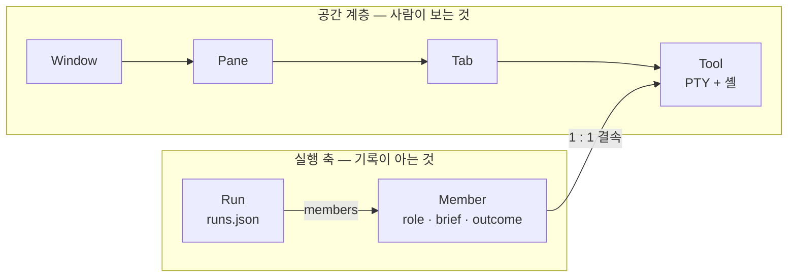
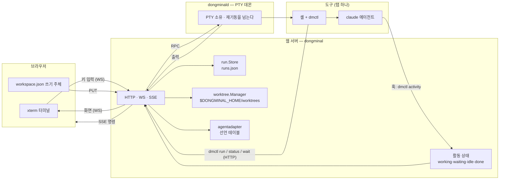
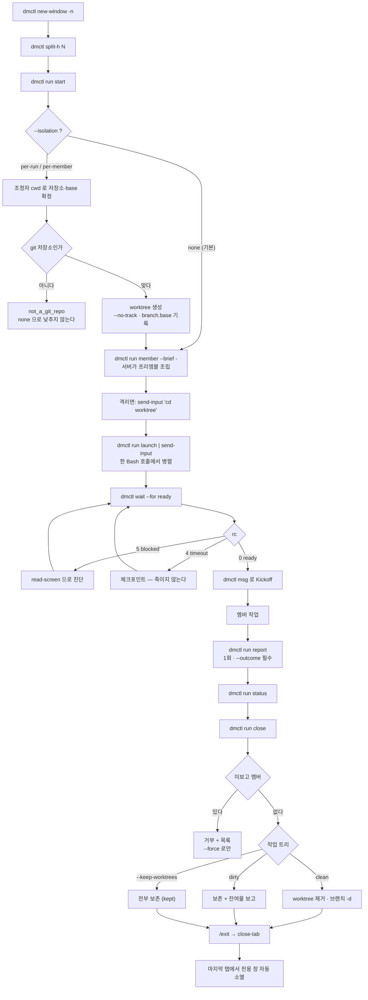
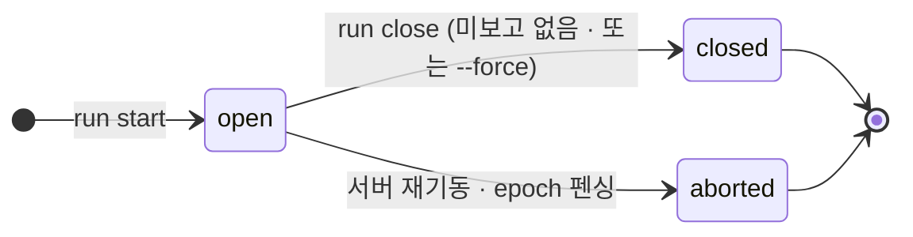
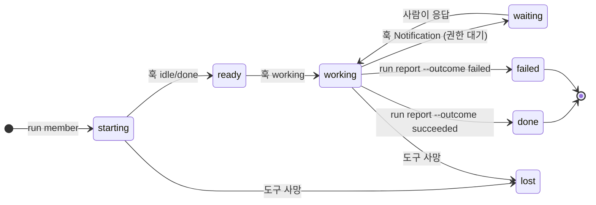

# 아키텍처

## 패키지 레이아웃

```
cmd/dongminal/         # composition root (main)
internal/
  adapters/            # internal/{server,workspace} → internal/toolaccess 인터페이스 브리지
  agentadapter/        # 에이전트별 선언 테이블 (기동·탐지·프롬프트/정책 주입·훅 파서·종료)
  clientpid/           # 원격 TCP(remoteAddr) → client PID (ps/lsof)
  migrate/             # v1 → v2 엔티티 스키마 1회성 변환 (진입점: `./scripts/migrate.sh`)
  outbuf/              # PTY 출력 바운디드 버퍼 (Stream — readPTY 와 WS/HTTP 리더 통합)
  run/                 # Run(오케스트레이션 실행) 레코드 — runs.json 저장소 + 투영/격리 타입 + 멤버 프리앰블
  runtime/             # helper symlink 설치 + 셸 훅 embed + agent-hooks 생성
    shellhooks/        # bash-hook.sh, zdotdir/.zshrc (실제 파일)
  runtimebin/          # dmctl/edit/download/detach multi-call CLI 구현
  server/              # HTTP/WS/SSE 라우팅, ToolManager, CommandHub, settingsStore
  toolaccess/          # 도구(PTY)·워크스페이스·커맨드 허브 접합면 인터페이스
  sysstat/             # 상태바 지표를 커널에서 직접 읽는다 (cgo 격리 — mach host_statistics)
  toolline/            # dmctl 공용 한 줄 렌더러 (byte-level 동일 출력 보장)
  uuid/                # 엔티티 uuid(UUID v7) 생성·파싱
  workspace/           # workspace.json 인덱싱·resolve·영속화 (Manager + FilePersister)
  worktree/            # Run 격리의 git worktree 생성·정리 + 안전 가드 (파괴적 동작의 유일한 경로)
web/                   # 프론트엔드 자산 (HTML/CSS/JS) + embed.FS()
scripts/               # start/stop/health/migrate.sh (개발자·운영자 대상)
.env / .env.example    # start.sh 가 자동 로드하는 환경변수(PORT, BINARY, LOG, DONGMINAL_HOME)
docs/
  internal/            # 개발자 문서 (이 파일)
  external/            # 사용자 문서
```

`internal/` 는 Go 언어 레벨에서 외부 import 를 막아 캡슐화를 강제한다. 외부 의존성이 필요한 모듈은 의도적으로 `internal/` 밖(현재는 `web/` 만 해당)으로 뺀다.

## 런타임 헬퍼 배포 (`internal/runtime`)

`runtime.Install(binDir)` 이 `main()` 초기화에서 `$DONGMINAL_HOME/bin/` 을 채운다.

**helper CLI** 는 `internal/runtimebin` 의 multi-call dispatch 로 dongminal 바이너리 자체가 처리하므로, `bin/<name>` 은 실행 파일을 가리키는 symlink (미지원 환경에선 복사) 다. `runtimebin.HelperNames()` 가 단일 소스:

- `dmctl` — `/api/commands` 로 워크스페이스 action 브로드캐스트 + `list-workspace`/`who-am-i`/`notify`/`activity` + 에이전트 접합면(`read-screen`/`send-input`/`msg`/`status`/`wait`/`run`). 아래 "에이전트 접합면과 Run" 절.
- `edit` — `POST /api/commands` 로 `openEditorTab` 브로드캐스트 (내장 편집기 탭).
- `download` — OSC 777 `Download;<abs>` 출력.
- `detach` — 현재 도구를 백그라운드로 보내고 탭을 닫는다 (`--list` / `--restore <id>`).

**셸 훅** 은 shell 문법이 필수라 임베드 파일을 그대로 풀어둔다:

- `bash-hook.sh` — `PROMPT_COMMAND` 에 `_rt_cwd_hook` 주입, OSC 777 `Cwd;<pwd>`.
- `zdotdir/.zshrc` — zsh 용 `precmd`/`chpwd` 훅. `~/.zshrc` 를 먼저 source.

**agent-hooks** — `installAgentHooks` 가 `bin/agent-hooks/` 에 Claude Code hooks settings 를 생성한다. hook 커맨드는 `dmctl` 을 절대경로로 참조해, PATH 앞쪽의 낡은 `dmctl` 이 `notify` 를 모르는 사고를 막는다.

도구 스폰 시 `StartTool` 이 환경을 덧붙인다 (`internal/server/tool.go`):

```
PATH=<기존>:$DONGMINAL_HOME/bin
zsh  → ZDOTDIR=$DONGMINAL_HOME/bin/zdotdir
bash → BASH_ENV=$DONGMINAL_HOME/bin/bash-hook.sh
TERM=xterm-256color, COLORTERM=truecolor, LANG/LC_ALL/LC_CTYPE=en_US.UTF-8
DONGMINAL_PORT=<서버 포트>   # main() 이 setenv, 자식 PTY 가 상속
DONGMINAL_TOOL_ID=<도구 id>  # detach 가 자기 도구를 식별하는 근거
```

## 파일 편집기 (`web/js/file-editor.js`)

`edit <path>` 는 `POST /api/commands` 로 `openEditorTab` 을 브로드캐스트하고, 브라우저가 그 탭에 Monaco Editor 를 띄운다. 서버 쪽 표면은 파일 I/O 두 개뿐이다.

- `GET /api/file/read?path=<abs>` — 절대경로만 허용. 디렉터리·심볼릭 링크 이탈은 거부.
- `POST /api/file/write` — 바디 `{path, content}`.

도구 타입은 `terminal` 과 `editor` 두 가지다 (`web/js/helpers.js` 의 capability 맵). `editor` 는 `backgroundCapable=false` 이므로 detach 대상이 아니다 (FR-BG-11).

과거의 code-server 통합(`internal/server/codeserver.go`, `/cs/<id>/` 리버스 프록시, `CodeServerManager`)은 `8dc0a3f` 에서 이 내장 편집기로 대체되며 제거됐다.

## 에이전트 접합면과 Run

도구 안에서 도는 에이전트가 워크스페이스를 조회·조작하는 경로다. **액션은 `dmctl`
서브커맨드, 정책은 세션 스코프로 주입되는 스킬**이며 MCP 는 없다
(`SKILL_INJECTION_SRS`). 셸만 있으면 되므로 에이전트 종류에 매이지 않는다.

| 엔드포인트 | dmctl | 쓰임 |
|---|---|---|
| `GET /api/tools/output` | `read-screen` / `read-output` | 다른 도구의 화면·출력 |
| `POST /api/tools/input` | `send-input` | 붙여넣기(bracketed paste + 120ms submit) |
| `POST /api/tools/message` | `msg` | 에이전트 간 신뢰 엔벨로프 |
| `POST /api/tools/activity/set` | `activity` (훅 브리지) | 에이전트 상태 보고 |
| `GET /api/tools/activity/get` | `status` | 그 도구의 에이전트 상태 |
| `GET /api/tools/activity/wait` | `wait --for ready\|done` | 상태 대기 (**서버 long-poll**) |
| `POST /api/runs`·`/members`·`/report`·`/close`, `GET /api/runs` | `run …` | 실행 기록 |
| `GET /api/runs/preamble` | `run launch` | 멤버 프리앰블 조회·재조회 |

**준비완료 판정은 화면이 아니라 훅이다.** `dmctl activity` 가 보고한
`working/waiting/done/idle` 이 1차 근거이고, 훅이 없는 에이전트만 "출력이 3초 정적"
폴백으로 판정한다. `waiting`(권한 확인 대기)은 준비완료가 아니라 `blocked` 로 즉시
반환한다 — 시간이 지난다고 풀리지 않기 때문이다. 타임아웃은 실패가 아니라
체크포인트다 (`RUN_ORCHESTRATION_SRS` 묶음 S).

**Run 은 공간 계층과 직교한 실행 축**이다 (`internal/run`). `runs.json` 에 영속되며,
서버 기동마다 발급하는 epoch 로 이전 세대가 열어둔 Run 을 로드 시 `aborted` 로
확정한다 — 백그라운드 도구가 재기동을 넘지 못하므로 되살릴 실체가 없다. 멤버 상태는
저장하지 않고 **조회 시점에 파생**한다(도구가 죽었으면 `lost`, 훅 상태가 그대로).
단 보고를 마친 멤버는 기록이 관측을 이긴다.

보고(`run report`)의 권한은 **발신 도구의 정체**다 — 페이로드에 실린 id 를 아는 것은
권한이 아니다. PID 부모 체인 해석이 우선이고 `DONGMINAL_TOOL_ID` 는 daemon 모드
폴백이다.

`Tab.runId` · `Window.ownerRunId` 표식은 **best-effort** 다. `workspace.json` 의 쓰기
주체는 브라우저이고 그쪽 409 처리가 머지 없이 재PUT 이므로 동시 편집에 지워질 수
있다. 소유권의 진실은 `runs.json` 이다.

## 오케스트레이션 다이어그램

아래 넷은 산문이 이미 말한 것을 **그림으로 다시 말하지 않는다** — 글로는 조립해야만
보이는 것(축의 직교성, 소유 경계, 판단이 갈리는 분기, 타입 간 결속)만 담았다.

### 축 — Run 은 계층의 레벨이 아니다



계층으로 만들면 "공간을 차지하지 않고 백그라운드로만 도는 팀"을 표현할 수 없다.
투영(`dedicated-window` | `background` | `inline`)이 선택인 이유가 이것이다. Member 와
Tool 의 1:1 결속은 보고 권한의 근거이기도 하다 — 한 도구는 열린 Run 하나에만 속한다.

### 프로세스 경계 — 누가 무엇을 소유하는가



에이전트가 서버에 말을 거는 통로는 **도구 셸의 `dmctl` 하나**다. 상태의 원천은 훅이고,
화면은 진단에만 쓴다.

### 팀 한 바퀴 — 판단이 갈리는 두 분기



기동부터 Kickoff 까지는 **하나의 어시스턴트 턴** 안에서 끝나야 한다. 그리고 `brief` 는
기동 프롬프트에 실리므로 멤버는 뜨자마자 시작한다 — 팀원 간 협업 지시를 brief 에 담으면
상대가 아직 없을 때 송신해 데드락이 된다.

### 타입 — 세 패키지가 각자 하나씩만 안다


`Worktree` 가 기록과 파일시스템의 접점이다 — 생성 시 경로·브랜치·base 를 받고, 정리 뒤에는
`Removed`·`Residue` 가 채워져 `run status` 가 나중에도 잔여물을 말한다.

### 상태 — 무엇이 권위인가





멤버 상태는 대부분 조회 시점에 파생되고, **보고는 기록이 관측을 이긴다** — 보고를 마친
멤버는 프롬프트로 돌아가 유휴가 되어도 `done` 이다. `waiting` 은 준비완료가 아니다.

## 에이전트 어댑터 레지스트리 (`internal/agentadapter`)

에이전트별 지식은 **선언 테이블 하나**다. 전에는 훅 파서가 `dmctl_activity.go` 의
`switch agent` 에 박혀 있었고, 기동 커맨드·정책 주입 방식·종료 지시는 **코드에 아예
없이 스킬 산문에만** 있었다 — 산문이 코드와 갈라져도 아무도 몰랐다.

필드는 `id` / `detectCmd` / `launch` / `modelFlag` / `promptInjection` /
`policyInjection` / `hookParse` / `readiness` / `exitCommand` 다. **정책은 담지
않는다** — "무엇을 왜 어떤 순서로"는 스킬의 몫이고, 레지스트리는 "이 에이전트를
어떻게 띄우고 어떻게 상태를 읽는가"만 답한다.

알 수 없는 에이전트 id 는 **명확한 오류**다. 기본 에이전트로 조용히 폴백하지 않는다.
예외는 `dmctl activity <agent>` 하나 — 에이전트 훅으로 도므로 비0 종료가 사용자의
도구 호출을 막는다. 그 경로만 stderr 로 말하고 rc=0 을 지키며, 기록에 들어가는
통로(`run member` · `POST /api/runs/members`)는 rc=2 / 400 으로 거부한다.

**검증 대상은 Claude Code 다.** codex 선언은 유지하되 best-effort 이며, 확인하지
못한 값(모델 플래그·종료 지시·위치 인자 프롬프트)은 추측해 채우지 않고 비워 둔다 —
틀린 플래그는 기동 자체를 깨뜨려 없는 것보다 나쁘다. codex 의 표준 notify 는
`agent-turn-complete` 하나뿐이라 준비완료를 훅으로 알 수 없고(`readiness.hooks=false`),
출력 3초 정적 폴백으로 판정된다.

정책 주입은 **세션 스코프**다. 실제 주입기는 `internal/runtime` 의 셸 래퍼이고,
그 래퍼가 레지스트리 선언과 어긋나지 않는지는 `internal/runtime` 의 대조 테스트가
지킨다 — 이 대조가 없으면 선언은 아무도 읽지 않는 산문으로 되돌아간다.

`readiness.screenPatterns` 는 준비완료 판정 사다리 2단계의 자리지만 **소비자가
없다.** 의도적 보류다 — 화면 패턴은 사용자가 하단 스테이터스라인 하나만 붙여도
깨지며, 그것은 team 스킬의 `╭─`·`Thinking...` fingerprint 를 없애려는 이유와 같은
취약성이다.

## 멤버 프리앰블 (`internal/run/preamble.go`)

멤버 기동 시 주입하는 역할·프로토콜 지시문이며 **평문**이다. 구조화 페이로드가
아니라, 실제 실행할 `dmctl` 예제에 Run·Member uuid 를 박아 넣은 텍스트를
`send-input` 으로 붙여넣는다. 행동 규칙은 **각 예제 바로 위**에 둔다 — LLM 독자는
예제에 정박하고 뒤따르는 산문은 훑는다.

**조립 주체는 서버다.** 멤버 생성 시점에 Run·Member uuid·조정자·worktree 를 이미
전부 알고 있어 조정자가 uuid 를 옮겨 적을 일이 없고, 프리앰블에 적힌 규칙은 서버가
실제로 강제하는 계약(1회 보고·outcome 필수·발신자 정체 권한)의 문장화라 강제 코드와
같은 패키지에 있어야 갈라지지 않는다. 역할 본문(`--brief`)만 정책이라 스킬이 넣고
서버가 합성한다.

`brief` 는 Member 레코드에 영속한다. 프리앰블이 **재조회 가능**해야 하기 때문이다 —
붙여넣기가 실패했거나 조정자가 컨텍스트를 잃어도 `GET /api/runs/preamble?member=`
가 같은 텍스트를 다시 만든다.

CLI(`dmctl run launch`)가 하는 일은 그 평문을 어댑터가 선언한 기동 방식으로 감싸는
것뿐이다. 프롬프트는 **홑따옴표**로 감싼다 — 큰따옴표 + 역슬래시 이스케이프는
`"`·`$`·백틱·`\` 를 각각 처리해야 하고 하나만 빠져도 셸이 본문을 전개한다.
`promptInjection` 이 `argv` 가 아니면 기동줄에 프롬프트를 싣지 않고, 호출자가
준비완료를 기다렸다 따로 붙여넣는다.

멤버를 띄우는 순서는 **셋이고 건너뛸 수 없다** — `run launch` → `wait --for ready`
→ Kickoff(`msg`). 2를 건너뛰면 에이전트가 아직 뜨지 않아 첫 지시가 셸에 텍스트로
찍히고 증발한다. 준비완료는 화면 모양이 아니라 훅 상태로 판정한다.

기동줄은 **손으로 조립하지 않는다.** `dmctl run launch` 가 어댑터 선언을 반영해
만든다 — 권한 사전 허용(`--allowedTools "Bash(dmctl:*)"`)이 빠지면 멤버가 첫 보고
명령에서 승인 대기에 걸리고, 인자 구분자(`--`)가 빠지면 가변 인자 플래그가 프리앰블을
삼켜 빈 프롬프트로 뜬다. 둘 다 실제 팀을 띄워 밟은 결함이며, 스킬이 기동줄을
직접 쓰지 못하게 `internal/runtime` 의 계약 테스트가 막는다.

## worktree 격리 (`internal/worktree`)

격리는 **Run 단위 선택**이고 기본은 `none` 이다. "독립 태스크·병렬 실행·편의"는
격리 사유가 아니다 — 신뢰 채널 협업 토폴로지 일부는 **파일 공유를 전제**하므로
격리하면 오히려 깨진다. `per-run` 은 Run 전체가 트리 하나를 공유하고 `per-member`
는 멤버마다 하나다.

생성은 `git worktree add --no-track -b <branch> <path> [<base>]` 다. `--no-track`
이 핵심이다 — base 의 upstream 을 물려받으면 push 전에 `git status` 가 "behind by
N" 을 오보한다. 대신 `push.autoSetupRemote` 를 걸고, 생성 base 를
`branch.<name>.base` 에 남긴다(나중에 "이 브랜치가 무엇에서 갈라졌나"를 물을 유일한
근거). 저장소와 base 는 **조정자의 cwd** 에서 확정한다 — 서버의 cwd 가 아니므로
`dmctl run start` 가 실어 보낸다. git 저장소가 아니면 **명확히 실패**하며, 조용히
`none` 으로 낮추지 않는다.

경로·브랜치는 uuid 에서 파생하고 **재사용하지 않는다** — 에이전트 CLI 는 대화
이력을 cwd 로 키잉하므로 지워진 경로를 다시 쓰면 새 멤버가 남의 이력을 물려받는다.
조각은 `short`(앞 8자)가 아니라 `run.PathSlug`(앞 8 + 뒤 8)다: uuid v7 의 앞 48비트는
밀리초 타임스탬프라 **같은 기간에 열린 Run 은 전부 같은 short 를 갖는다.**

정리는 `run close` 가 한다. **clean 한 트리만 지우고 브랜치는 `-d`(머지된 것만)로
지운다.** dirty 면 지우지 않고 **잔여물로 보고**한다 — 사용자 작업의 조용한 삭제는
금지다. `-D` 는 생성 실패의 롤백에서만 쓴다(사용자 작업이 없다는 것이 확실한 경우).
정리 대상은 **Run 레코드에 등록된 것뿐**이며, 같은 루트 아래에 사용자가 만든 트리가
있어도 건드리지 않는다. 제거 전에 경로가 실제로 `$DONGMINAL_HOME/worktrees/` 아래인지
확인하고, 저장소 자신·파일시스템 루트·`..` 이탈은 거부한다. 정리 결과는 레코드에
영속되므로 `run status` 가 나중에도 잔여물을 말한다.

worktree 조작은 **직렬화**한다. 공용 common-dir 을 건드려 병렬 팬아웃에서 경합한다.

## 스킬 (`internal/runtime/agentplugin/skills`)

`team`(1회성 팀)과 `workflow`(재사용 정의서) 둘이며, **정책만 담고 액션은 전부
`dmctl`** 이다. 세션 스코프로 주입되므로 사용자의 `~/.claude` 를 건드리지 않는다.

기본 토폴로지는 **전용 창**이다 — 팀은 `dmctl new-window -n` 으로 만든 자기 창에서
살고 사용자 창을 쪼개지 않는다. 그 결과 예전 스킬 규칙의 절반을 차지하던 사용자
공간 방어(`--no-focus` 강제, `dmctl focus` 전면 금지, 셀 비율 레이아웃 계산)가
**구조로 풀려** 규칙에서 사라졌다. `inline` 은 관찰용 선택지로만 남는다.

준비완료 판정에 **화면 fingerprint 를 쓰지 않는다.** 그 판정은 에이전트 버전이나
사용자의 스테이터스라인 하나로 깨지고, 무엇보다 권한 대기와 준비완료를 구분하지
못한다. 팀원 매핑표도 대화 기록에 두지 않는다 — 진실은 `dmctl run status` 이며,
컨텍스트 압축을 넘어간다.

스킬은 산문이라 컴파일도 테스트도 되지 않는다. 그래서 되돌아가면 곧바로 걸리는
것만이라도 검출기로 세워 뒀다 (`internal/runtime/skills_contract_test.go`) — 화면
fingerprint·수동 `sleep` 루프·삭제된 자산 참조·손으로 조립한 기동줄·필수 절차의
부재. 임베드된 트리를 직접 읽으므로 배포되는 것과 검사 대상이 같다.

## 커맨드 브로드캐스트 (`internal/server/commands.go`)

`CommandHub` 는 SSE 구독자 집합과 버퍼 크기 16 의 채널을 관리. `POST /api/commands` 로 들어온 action 을 `allowedCmdActions` 화이트리스트로 검증 후 구독자 전원에게 브로드캐스트. 버퍼가 꽉 차면 해당 구독자에 한해 드롭 + `[cmd] subscriber channel full` 로그.

`allowedCmdActions` 는 20개를 허용한다: `newWindow`/`newTab`/`splitH`/`splitV`/`focus`/`closeTab`/`closeWindow`/`windowNext`/`windowPrev`/`tabNext`/`tabPrev`/`paneUp`/`paneDown`/`paneLeft`/`paneRight`/`openEditorTab`/`renameTab`/`renameWindow`/`detachTab`/`restoreTool`.

그중 **엔터티를 만드는 6개**(`newWindow`/`newTab`/`splitH`/`splitV`/`openEditorTab`/`restoreTool`)는 `singleExecutorActions` 로, 서버가 `FocusRegistry.Executor()` 로 실행자 하나를 지명해 페이로드에 `execClientId` 를 싣는다. 지명되지 않은 브라우저는 그 명령을 건너뛴다. 게이팅이 없으면 구독 중인 브라우저 수만큼 PTY 가 생기고 하나만 참조돼 나머지가 고아가 된다 (WORKSPACE_IDENTITY_SRS FR-SXE-\*).

엔터티 id(Window·Pane·Tab)는 브라우저가 `crypto.randomUUID()` 로 만든다. 마이그레이션된 구 id(`s1`/`r1`/`t1`)도 그대로 유효하며 id 는 전 계층에서 opaque 문자열이다 (FR-WID-1/2).

`dmctl` 은 이 중 `detachTab`·`restoreTool` 을 제외한 나머지를 서브커맨드로 노출한다. 그 둘은 `toolId` 를 대상 지정자로 받아 `detach` CLI 전용 경로다.

이 화이트리스트는 생산자(브라우저 `_execRemote`, `dmctl`, `detach`)와 대조 검증된다 (`internal/server/commands_browser_test.go`). 생산자가 처리하는 action 이 여기 없으면 `POST /api/commands` 가 400 으로 거부해 브라우저 코드에 도달하지 못하는데, 스텁 서버로 테스트하는 CLI 쪽은 그 결함을 볼 수 없다.

## 어댑터 패턴

`internal/toolaccess` 는 `ToolReader`, `WorkspaceReader`, `CommandBroadcaster`, `ClientToolResolver` 같은 **인터페이스만** 정의한다. 구체 타입(`server.ToolManager`, `workspace.Manager`, `server.CommandHub`)은 그 인터페이스를 직접 구현하지 않는다. 대신 `internal/adapters` 가 브리지 역할을 한다.

- `adapters.Tool` — `*server.ToolManager` 를 `toolaccess.ToolReader` 로.
- `adapters.Workspace` — `*workspace.Manager` 를 `toolaccess.WorkspaceReader` 로.
- `adapters.Command` — `*server.CommandHub` 를 `toolaccess.CommandBroadcaster` 로.
- `adapters.Client` — `*server.ToolManager` + `clientpid` 를 `toolaccess.ClientToolResolver` 로.

import 방향은 단방향 (`adapters → {toolaccess, server, workspace, clientpid}`). server/workspace 는 toolaccess 를 몰라도 되며, toolaccess 는 server/workspace 의 구체 타입을 몰라도 된다. 테스트에서 인터페이스를 mock 하기 쉽다.

`adapters.Tool` 은 direct 모드(`*server.ToolManager`)와 daemon 모드(`server.ToolHub`) 의 이중 경로, bracketed paste, submit 지연을 한곳에 캡슐화한다. `/api/tools/{output,input,message}` 가 두 모드에서 동일하게 동작하는 근거다 — 이 어댑터를 우회해 핸들러에서 PTY 를 직접 만지면 daemon 모드가 깨진다.

## 성능: 핫패스 비차단

### `workspace.Manager.Save` (H5)

HTTP `PUT /api/workspace` 핸들러는 `Save(blob, ifMatch)` 호출 → 인덱스 빌드 + atomic swap 만 수행하고 디스크 쓰기는 **비동기 writer 고루틴** 에 넘긴다.

- `writeCh chan []byte` (버퍼 크기 1) + 전용 writer 고루틴.
- `enqueueWrite` 는 latest-wins 코얼레싱: 대기 중인 blob 이 있으면 덮어쓴다. 다수의 빠른 Save 가 들어와도 디스크 쓰기는 하나로 합쳐진다.
- `Manager.Close()` 는 `sync.Once` 로 writer 를 종료하고 마지막 blob 을 flush. `main.go` 의 shutdown 경로에서 `bd.pm.SaveAll()` 뒤 `bd.wsMgr.Close()` 로 호출.
- 측정치: 101.7 ms/call (동기 `os.WriteFile`) → 18 µs/call (atomic swap 만). 자세한 배경은 [FOLLOWUP_HOTFIX_RFC.md](./archive/FOLLOWUP_HOTFIX_RFC.md) §4-ter.

### 로깅 스킵 (H5 Track A)

`server.shouldLogRequest` 는 `/api/workspace*`, `/api/tools*`, `/api/ping`, `/api/stats` 에 대해 **정상 응답(status < 400) 만 로그 스킵**. 에러는 항상 로그. 분할/삭제 시 초당 수십 회 히트하는 엔드포인트의 로그 오버헤드 제거.

### 클라이언트 낙관적 UI (성능 재개선 턴)

`web/js/app.js` 의 `split`, `closeTab`, `addTab` 은 레이아웃 mutation + `render()` 를 **즉시** 실행하고 `_kill`, `_save` 를 await 하지 않고 fire-and-forget. `_save()` 는 내부 직렬화 큐로 ETag 경쟁을 방지하고 coalescing 수행.

또한 `/api/tools` POST 에 `cwdTool=<refToolId>` 쿼리 지원 → 클라이언트가 `/api/cwd` 사전 조회할 필요 없음 (RT 1 건 제거).

## 동시성

- `ToolManager` : 내부에 `sync.RWMutex`. `Snapshot()` 은 슬라이스 복사로 외부 공개. 백그라운드 도구는 `background map[string]BackgroundEntry` 로 같은 락 아래에서 관리한다.
- `workspace.Manager` : `atomic.Pointer[[]byte]` + `atomic.Pointer[*index]` + `atomic.Uint64` (rev). Save 내부에서만 `sync.Mutex` 로 직렬화. 리더는 락 없이 atomic load.
- `outbuf.Stream` : `sync.Mutex` + `atomic.Int64` (누적 카운터). Feed/Snapshot 모두 lock 내에서 slice 조작.
- `CommandHub` : SSE 구독자 list + broadcast. 내부 `sync.RWMutex`.

## 종료 경로

1. `signal.NotifyContext` 가 `SIGINT`/`SIGTERM` 포착 → ctx cancel.
2. `srv.Run` 이 리턴 (http.Server.Shutdown 내부 호출).
3. `panedClient.Close()` — 데몬 연결을 **가장 먼저** 닫아 `dongminald` 가 새 연결을 받을 수 있게 한다.
4. `bd.pm.SaveAll()` — `tools.json` 에 도구별 cwd 등 상태를 기록. 탭이 참조하는 도구만 기록하므로 백그라운드 도구는 데몬 재시작을 넘기지 않는다 (FR-BG-9).
5. `bd.wsMgr.Close()` — workspace writer 고루틴 flush + 종료.

순서 중요: `wsMgr.Close` 가 `SaveAll` 뒤여야 한다. 도구 상태 저장 중 workspace writer 가 살아 있어야 한다.

## 테스트

- `internal/server/*_test.go` — HTTP 라우팅, DI, 도구 CRUD, 커맨드 화이트리스트의 생산자 대조.
- `internal/workspace/*_test.go` — Save 비차단·coalescing·Close flush, parse, resolve.
- `internal/outbuf/*_test.go` — Feed/Snapshot/compaction/통계.
- `internal/runtime/*_test.go` — bin/ 전개, 세션 스코프 플러그인·훅 생성.
- `internal/runtimebin/*_test.go` — dmctl 서브커맨드 플래그 파싱·HTTP 호출.

Go 관례대로 `*_test.go` 는 각 패키지 안에 공존. Black-box 테스트가 필요한 경우 `package xxx_test` 를 사용.
